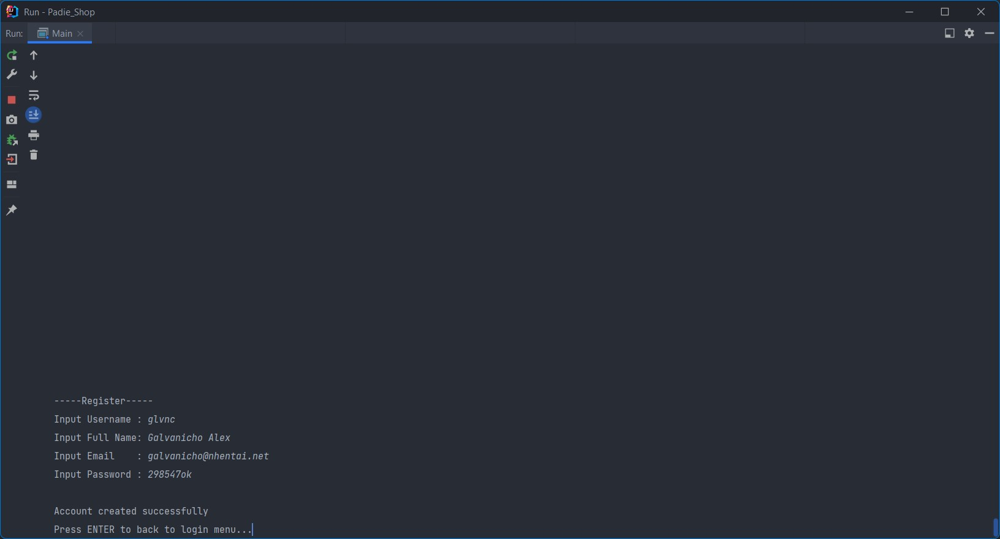
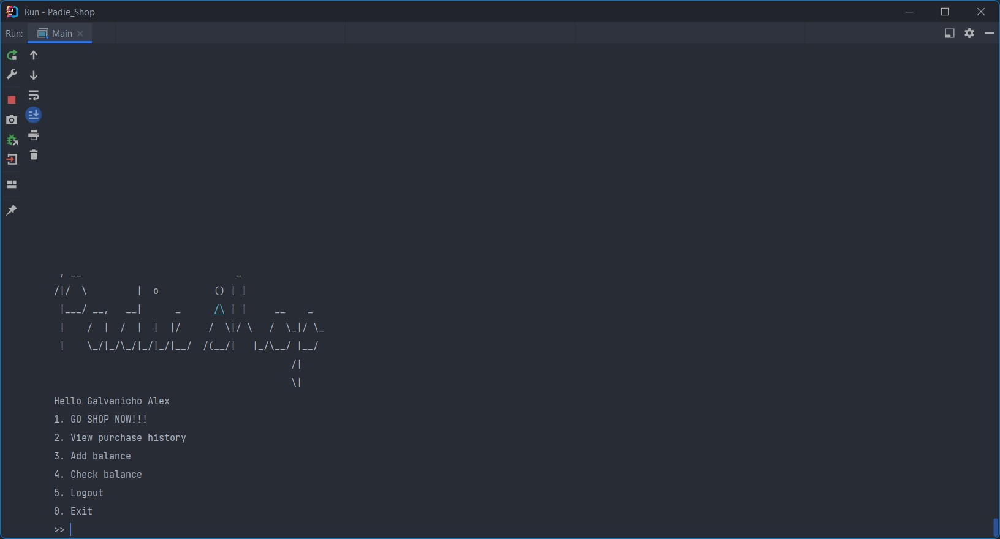
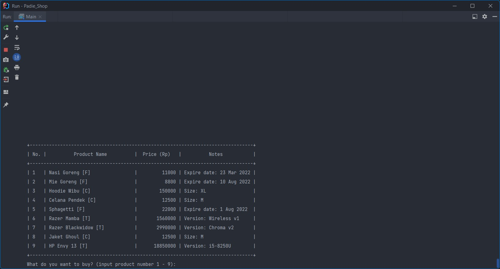
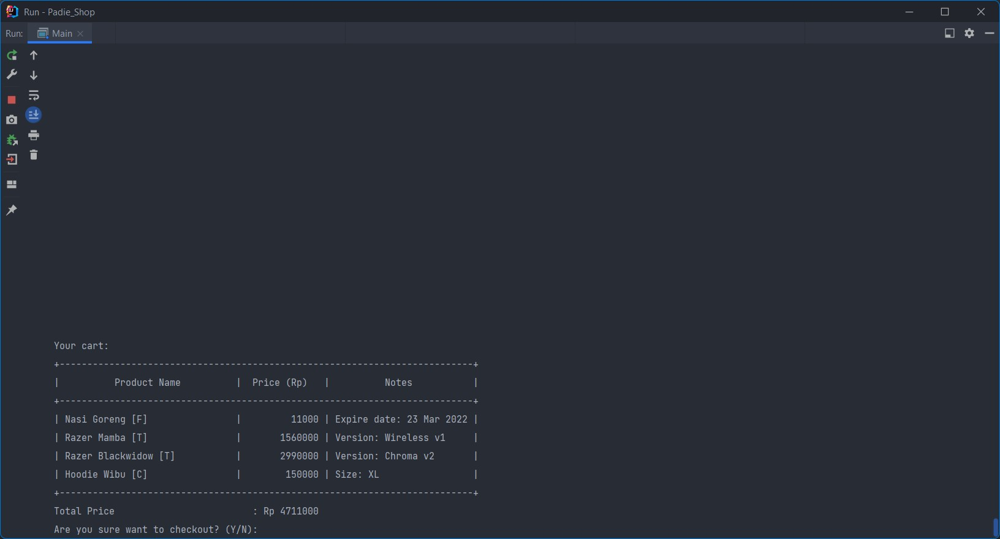
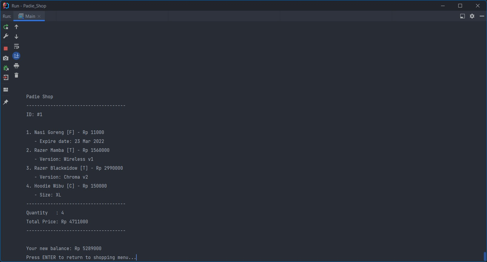

# Padie Shop

---

Simple shopping app command line-based using Java for LnT class Mid Project

### Implementing:

- Collection (Arraylist and Hashmap)
- OOP Principle

### Screenshot of program

- Account registration

- Main Menu

- View Products

- Checkout

- Receipt
